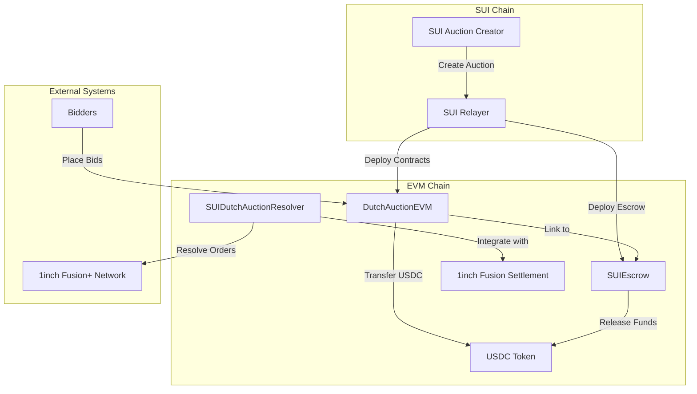
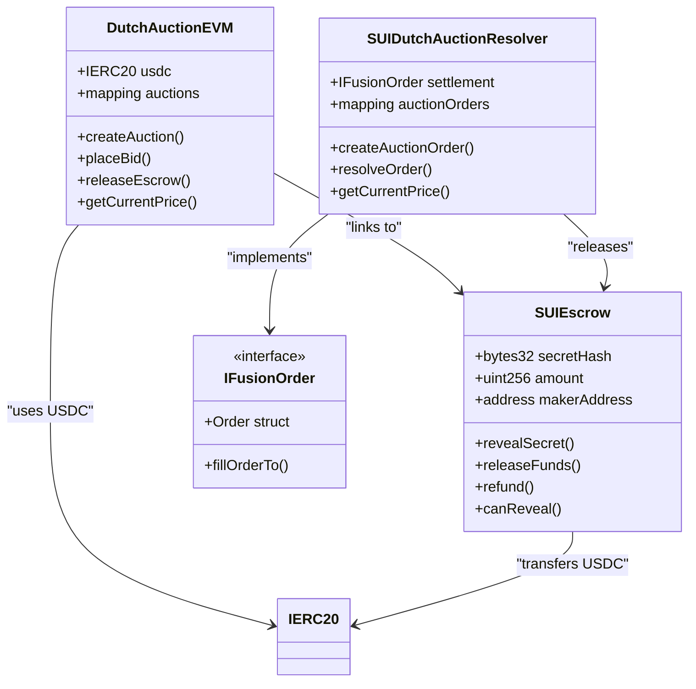
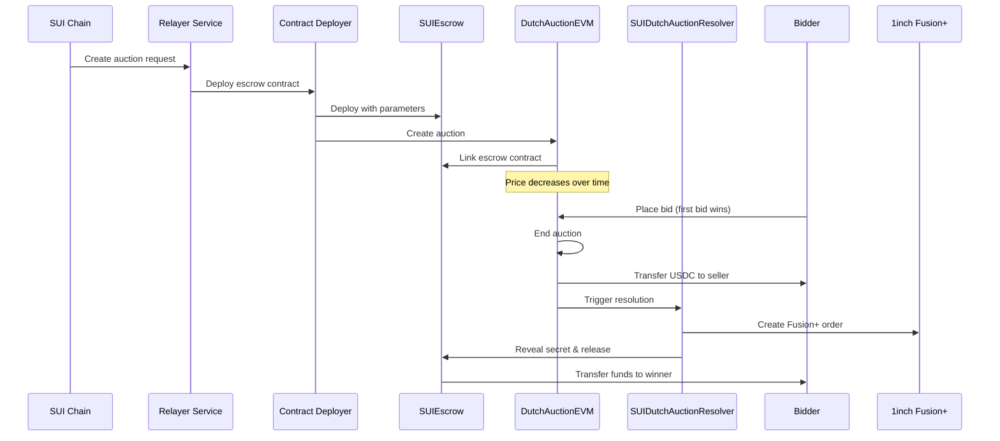
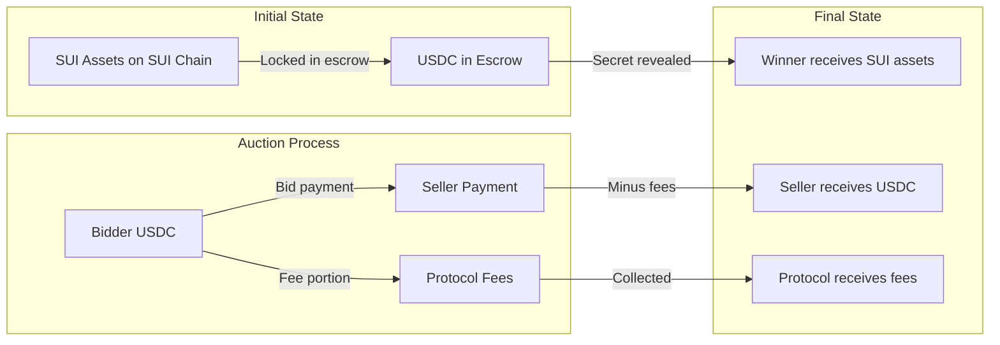

# EVM Contracts 分析报告

## 项目概述

`evm-contracts` 包是 1inch-on-sui 项目的核心 EVM 智能合约模块，实现了跨链荷兰式拍卖系统，集成了 1inch Fusion+ 协议。该系统允许用户在 SUI 链上创建拍卖，在 EVM 链上进行竞拍，并通过原子化的跨链交换完成交易。

## 核心功能

### 1. 跨链荷兰式拍卖
- 支持从 SUI 链到 EVM 链的资产拍卖
- 价格随时间线性递减的荷兰式拍卖机制
- 集成 1inch Fusion+ 协议实现 MEV 保护

### 2. 托管合约系统
- 基于哈希锁的资金托管
- 时间锁机制防止资金永久锁定
- 支持紧急退款功能

### 3. 1inch Fusion+ 集成
- 自定义解析器实现原子化交易
- 支持批量订单处理
- 内置 MEV 保护机制

## 技术架构

### 系统架构图

### 合约关系图

## 数据流向图

### 完整交易流程

### 资金流向图

## 核心合约详解

### 1. DutchAuctionEVM.sol

**功能**: 主要的荷兰式拍卖合约

**核心特性**:
- 支持创建与 SUIEscrow 合约关联的拍卖
- 线性价格递减机制
- 首次出价即获胜的机制
- 协议费用收取（默认 2.5%）
- 与托管合约的集成

**关键函数**:
- `createAuction()`: 创建新的拍卖
- `placeBid()`: 参与竞拍
- `releaseEscrow()`: 释放托管资金
- `getCurrentPrice()`: 获取当前价格

### 2. SUIEscrow.sol

**功能**: 跨链资金托管合约

**核心特性**:
- 基于哈希锁的资金锁定
- 时间锁机制（24小时揭示窗口）
- 支持紧急退款
- 原子化的揭示和释放操作

**关键函数**:
- `revealSecret()`: 揭示秘密
- `releaseFunds()`: 释放资金
- `refund()`: 退款操作
- `revealAndRelease()`: 原子化操作

### 3. SUIDutchAuctionResolver.sol

**功能**: 1inch Fusion+ 自定义解析器

**核心特性**:
- 与 1inch Fusion+ 协议集成
- 支持批量订单处理
- 授权操作员管理
- 紧急处理机制

**关键函数**:
- `createAuctionOrder()`: 创建拍卖订单
- `resolveOrder()`: 解析订单
- `getCurrentPrice()`: 获取当前价格

## 部署和集成

### 支持的网络

1. **Ethereum Sepolia**
   - RPC: Infura
   - USDC: `0x1c7D4B196Cb0C7B01d743Fbc6116a902379C7238`
   - Fusion Settlement: `0x1111111254eeb25477b68fb85ed929f73a960582`

2. **Base Sepolia**
   - RPC: Base 官方
   - USDC: `0x036CbD53842c5426634e7929541eC2318f3dCF7e`
   - Fusion Settlement: `0x1111111254eeb25477b68fb85ed929f73a960582`

### 部署脚本

- `deploy-script.js`: 主要部署脚本，支持监听中继器参数
- `fusion-resolver-integration.js`: Fusion+ 集成管理
- `complete-fusion-demo.js`: 完整演示脚本

## 安全特性

### 1. 重入攻击防护
- 所有关键函数使用 `nonReentrant` 修饰符
- 遵循 CEI (Checks-Effects-Interactions) 模式

### 2. 时间锁机制
- 托管合约具有时间锁保护
- 24小时揭示窗口防止资金永久锁定

### 3. 访问控制
- 基于 OpenZeppelin 的 `Ownable` 合约
- 授权操作员机制
- 紧急功能仅限管理员

### 4. 输入验证
- 严格的参数验证
- 地址零值检查
- 数值范围验证

## 技术栈

### 开发框架
- **Hardhat**: 智能合约开发和测试框架
- **OpenZeppelin**: 安全的智能合约库
- **Ethers.js**: 以太坊交互库

### 依赖项
- `@1inch/fusion-sdk`: 1inch Fusion+ SDK
- `@1inch/limit-order-protocol`: 1inch 限价订单协议
- `dotenv`: 环境变量管理
- `express`: HTTP 服务器框架

### 编译配置
- **Solidity 版本**: 0.8.20
- **优化器**: 启用，200 次运行
- **目标网络**: Sepolia, Base Sepolia

## 使用场景

### 1. 跨链资产拍卖
用户可以在 SUI 链上创建拍卖，在 EVM 链上接受竞拍，实现跨链资产交换。

### 2. MEV 保护交易
通过 1inch Fusion+ 集成，提供内置的 MEV 保护，确保交易的公平性。

### 3. 原子化跨链交换
单笔交易完成跨链资产交换，减少交易风险和复杂性。

## 性能指标

### Gas 优化
- 合约代码经过优化器处理
- 使用 `immutable` 变量减少存储成本
- 批量操作支持降低平均 Gas 成本

### 交易确认
- 支持快速确认的测试网络
- 可配置的 Gas 价格策略
- 交易状态实时监控

## 未来扩展

### 1. 多链支持
- 扩展到更多 EVM 兼容链
- 支持不同的稳定币
- 跨链桥接优化

### 2. 高级拍卖机制
- 英式拍卖支持
- 密封竞价拍卖
- 批量拍卖功能

### 3. DeFi 集成
- 流动性挖矿奖励
- 治理代币集成
- 收益农场功能

## 结论

`evm-contracts` 包实现了一个创新的跨链拍卖系统，通过集成 1inch Fusion+ 协议，提供了安全、高效的跨链资产交换解决方案。该系统具有以下优势：

1. **安全性**: 多层安全机制保护用户资金
2. **效率**: 原子化交易减少交易步骤
3. **公平性**: MEV 保护确保交易公平
4. **可扩展性**: 模块化设计支持未来扩展

该项目为跨链 DeFi 生态系统提供了重要的基础设施，有望推动跨链交易的发展和普及。