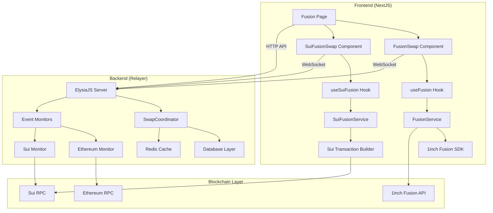
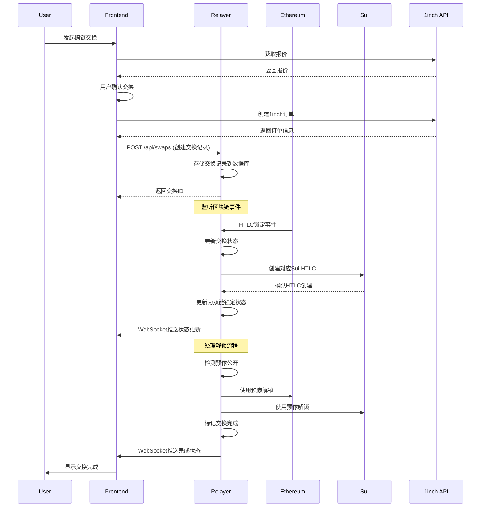

# NextJS与Relayer集成分析报告

## 项目概述

本报告分析了1inch on Sui项目中NextJS前端与Relayer后端服务之间的集成架构、数据流向以及需要配合修改的关键接口。该项目实现了基于HTLC的以太坊和Sui之间的跨链原子交换。

## 系统架构



## 数据流向图



## 当前集成状态分析

### 1. NextJS前端架构

**核心组件结构：**
- **主页面**: `/app/fusion/page.tsx` - 主要交换界面
- **组件**: 
  - `FusionSwap.tsx` - 以太坊端1inch Fusion集成
  - `SuiFusionSwap.tsx` - Sui端交换组件
- **服务层**:
  - `FusionService.ts` - 1inch Fusion SDK包装
  - `SuiFusionService.ts` - Sui交易构建服务

**钱包集成：**
- 双钱包架构：同时支持以太坊钱包(wagmi/RainbowKit)和Sui钱包(@mysten/dapp-kit)
- 状态管理：使用Zustand进行全局状态管理

### 2. Relayer后端架构

**核心服务结构：**
- **主服务**: ElysiaJS服务器，端口3001
- **协调器**: `SwapCoordinator` - 管理交换生命周期
- **监听器**: 
  - `ethereum.ts` - 以太坊事件监听
  - `sui.ts` - Sui事件监听
- **API层**: RESTful API + WebSocket实时更新

**数据层：**
- **持久化**: Drizzle ORM + SQLite数据库
- **缓存**: Redis用于性能优化和状态缓存

## 需要配合修改的关键接口

### 1. 缺失的前后端API连接 🔴

**问题**: NextJS前端组件缺少与Relayer后端的直接API集成

**影响**: 
- 无法实现跨链交换的完整流程
- 缺少交换状态的实时监控
- 无法获取交换历史和统计数据

**需要修改的文件：**

#### Frontend (NextJS)
```typescript
// 需要新增: packages/nextjs/services/relayer/RelayerApiService.ts
interface RelayerApiService {
  createSwap(swapData: SwapCreationParams): Promise<SwapRecord>
  getSwapStatus(swapId: string): Promise<SwapStatus>
  getSwapHistory(): Promise<SwapRecord[]>
  subscribeToSwapUpdates(callback: (update: SwapUpdate) => void): void
}

// 需要修改: packages/nextjs/components/fusion/FusionSwap.tsx
// 添加Relayer API调用
const handleCreateOrder = async () => {
  // 1. 创建1inch订单
  const order = await fusion.createOrder(params);
  
  // 2. 通知Relayer创建对应记录
  const swapRecord = await relayerApi.createSwap({
    orderId: order.orderHash,
    maker: address,
    makingAmount: amount,
    // ... 其他参数
  });
  
  // 3. 开始监听状态更新
  relayerApi.subscribeToSwapUpdates((update) => {
    if (update.swapId === swapRecord.id) {
      setSwapStatus(update.status);
    }
  });
};
```

#### Backend (Relayer)
```typescript
// 需要修改: packages/relayer/src/routes/api/swaps.ts
// 将临时的mock实现替换为真实的数据库操作

// 当前问题代码 (line 102-104):
async findSwaps(query: any) {
  return { swaps: [], total: 0 }; // Temporarily return empty data
},

// 需要修改为:
async findSwaps(query: any) {
  const db = this.dbManager.getDatabase();
  const result = await db.select().from(swaps)
    .where(/* 根据query参数构建条件 */)
    .limit(query.limit || 10)
    .offset((query.page - 1) * (query.limit || 10));
  return { swaps: result, total: result.length };
},
```

### 2. WebSocket实时通信缺失 🔴

**问题**: 前端缺少WebSocket连接来接收交换状态实时更新

**需要修改的文件：**

#### Frontend WebSocket Hook
```typescript
// 需要新增: packages/nextjs/hooks/fusion/useRelayerWebSocket.ts
export const useRelayerWebSocket = (swapId?: string) => {
  const [socket, setSocket] = useState<WebSocket | null>(null);
  const [swapUpdates, setSwapUpdates] = useState<SwapUpdate[]>([]);
  
  useEffect(() => {
    const ws = new WebSocket('ws://localhost:3001/ws');
    
    ws.onmessage = (event) => {
      const update = JSON.parse(event.data);
      if (!swapId || update.swapId === swapId) {
        setSwapUpdates(prev => [...prev, update]);
      }
    };
    
    setSocket(ws);
    return () => ws.close();
  }, [swapId]);
  
  return { socket, swapUpdates };
};
```

#### Backend WebSocket实现
```typescript
// 需要修改: packages/relayer/src/websocket/index.ts
// 添加交换状态更新的广播功能

export class WebSocketManager {
  broadcast(event: string, data: any) {
    this.clients.forEach(client => {
      if (client.readyState === WebSocket.OPEN) {
        client.send(JSON.stringify({ event, data }));
      }
    });
  }
  
  broadcastSwapUpdate(swapUpdate: SwapUpdate) {
    this.broadcast('swap_update', swapUpdate);
  }
}
```

### 3. 交换状态管理不统一 🟡

**问题**: 前端和后端使用不同的状态枚举和管理方式

**需要修改：**

#### 统一状态定义
```typescript
// 需要新增: packages/shared/types/SwapTypes.ts (或在两个包中同步)
export enum SwapStatus {
  PENDING = 'pending',
  ETHEREUM_LOCKED = 'ethereum_locked', 
  SUI_LOCKED = 'sui_locked',
  BOTH_LOCKED = 'both_locked',
  COMPLETING = 'completing',
  COMPLETED = 'completed',
  REFUNDING = 'refunding', 
  REFUNDED = 'refunded',
  FAILED = 'failed'
}

export interface SwapRecord {
  id: string;
  orderId: string;
  maker: string;
  taker?: string;
  status: SwapStatus;
  sourceChain: 'ethereum' | 'sui';
  targetChain: 'ethereum' | 'sui';
  // ... 其他字段
}
```

### 4. 错误处理机制不完整 🟡

**问题**: 缺少统一的错误处理和用户反馈机制

**需要修改：**

#### Frontend错误处理
```typescript
// 需要修改: packages/nextjs/components/fusion/FusionSwap.tsx
// 添加更全面的错误处理

const [relayerError, setRelayerError] = useState<string | null>(null);

const handleCreateOrder = async () => {
  try {
    setRelayerError(null);
    
    // 1inch订单创建
    const order = await fusion.createOrder(params);
    
    // Relayer交换记录创建
    try {
      const swapRecord = await relayerApi.createSwap(swapData);
      setCurrentSwapId(swapRecord.id);
    } catch (relayerErr) {
      setRelayerError('Failed to register swap with relayer');
      // 可能需要取消1inch订单
    }
    
  } catch (error) {
    notification.error('Swap creation failed');
    setRelayerError(error.message);
  }
};
```

#### Backend错误处理增强
```typescript
// 需要修改: packages/relayer/src/services/coordination/swapCoordinator.ts
// 添加更详细的错误分类和恢复机制

export enum SwapErrorCode {
  ETHEREUM_CONNECTION_FAILED = 'ETH_CONN_FAIL',
  SUI_CONNECTION_FAILED = 'SUI_CONN_FAIL',
  INSUFFICIENT_GAS = 'INSUFFICIENT_GAS',
  TIMEOUT_EXPIRED = 'TIMEOUT_EXPIRED',
  INVALID_PREIMAGE = 'INVALID_PREIMAGE',
  CONTRACT_EXECUTION_FAILED = 'CONTRACT_EXEC_FAIL'
}
```

## 推荐的实施方案

### 阶段1: 基础API集成 (高优先级)

1. **创建RelayerApiService**: 在NextJS中实现与Relayer的HTTP API通信
2. **完善Swap API**: 在Relayer中实现完整的数据库操作替换mock数据
3. **统一数据类型**: 在两个包之间同步SwapRecord和SwapStatus定义

### 阶段2: 实时通信 (高优先级)

1. **WebSocket集成**: 在前端添加WebSocket连接管理
2. **状态广播**: 在Relayer中实现交换状态变更的实时广播
3. **UI状态更新**: 前端组件实时响应后端状态变化

### 阶段3: 用户体验优化 (中优先级)

1. **错误处理完善**: 实现统一的错误处理和用户反馈机制
2. **交换历史**: 添加交换历史查询和显示功能
3. **进度指示器**: 实现详细的交换进度可视化

### 阶段4: 高级功能 (低优先级)

1. **交换分析**: 添加交换统计和分析功能
2. **性能监控**: 实现前端性能监控和优化
3. **管理功能**: 添加管理员操作界面

## 具体修改清单

### 需要新增的文件

#### Frontend (NextJS)
- `packages/nextjs/services/relayer/RelayerApiService.ts` - Relayer API客户端
- `packages/nextjs/hooks/fusion/useRelayerWebSocket.ts` - WebSocket连接管理
- `packages/nextjs/hooks/fusion/useSwapStatus.ts` - 交换状态管理
- `packages/nextjs/components/fusion/SwapStatusDisplay.tsx` - 状态显示组件
- `packages/nextjs/types/relayer.ts` - Relayer相关类型定义

#### Backend (Relayer)
- `packages/relayer/src/services/notification/NotificationService.ts` - 通知服务
- `packages/relayer/src/middleware/cors.ts` - CORS中间件配置

### 需要修改的文件

#### Frontend (NextJS)
- `packages/nextjs/components/fusion/FusionSwap.tsx` - 添加Relayer集成
- `packages/nextjs/components/fusion/SuiFusionSwap.tsx` - 添加Relayer集成
- `packages/nextjs/app/fusion/page.tsx` - 添加WebSocket连接
- `packages/nextjs/services/store/store.ts` - 添加交换状态管理

#### Backend (Relayer)
- `packages/relayer/src/routes/api/swaps.ts` - 实现真实数据库操作
- `packages/relayer/src/services/coordination/swapCoordinator.ts` - 添加前端通知
- `packages/relayer/src/websocket/index.ts` - 完善WebSocket功能
- `packages/relayer/src/index.ts` - 添加CORS配置

## 总结

当前NextJS和Relayer之间缺少完整的API集成，主要表现在：

1. **API连接缺失**: 前端无法与后端进行数据交互
2. **实时通信缺失**: 缺少WebSocket连接进行状态更新
3. **状态管理不统一**: 前后端状态定义不一致
4. **错误处理不完整**: 缺少统一的错误处理机制

建议按照上述阶段性方案进行改进，优先实现基础API集成和实时通信功能，确保跨链交换的完整流程能够正常运行。