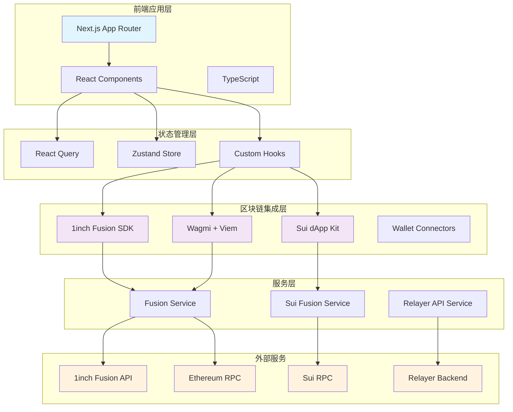
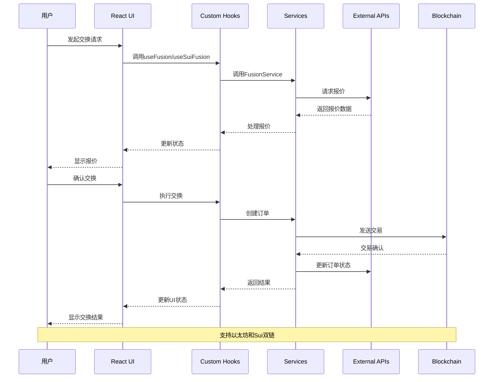

# 1inch on Sui - Next.js 前端技术分析报告

## 📋 项目概述

本项目是1inch on Sui生态系统的前端应用，基于Next.js构建，实现了跨链DEX聚合器功能，支持以太坊和Sui网络的代币交换。该应用集成了1inch Fusion SDK，提供MEV保护的交易体验。

## 🛠️ 技术栈分析

### 核心框架
- **Next.js 15.2.3** - React全栈框架，支持SSR/SSG
- **React 19.0.0** - 用户界面库
- **TypeScript 5.8.2** - 类型安全的JavaScript超集

### 区块链集成
- **@1inch/fusion-sdk 2.3.6** - 1inch Fusion协议SDK
- **@mysten/dapp-kit 0.17.2** - Sui网络dApp开发工具包
- **@mysten/sui 1.37.1** - Sui区块链JavaScript SDK
- **@suiet/wallet-kit 0.5.1** - Sui钱包连接器
- **@rainbow-me/rainbowkit 2.2.7** - 以太坊钱包连接UI
- **wagmi 2.15.6** - React Hooks for Ethereum
- **viem 2.31.1** - TypeScript以太坊接口

### UI/UX技术
- **Tailwind CSS 4.1.3** - 原子化CSS框架
- **DaisyUI 5.0.9** - Tailwind CSS组件库
- **@heroicons/react 2.1.5** - SVG图标库
- **next-themes 0.3.0** - 主题切换
- **react-hot-toast 2.4.0** - 通知组件

### 状态管理与数据获取
- **@tanstack/react-query 5.59.15** - 服务端状态管理
- **zustand 5.0.0** - 轻量级状态管理
- **usehooks-ts 3.1.0** - TypeScript React Hooks工具集

### 开发工具
- **ESLint 9.23.0** - 代码质量检查
- **Prettier 3.5.3** - 代码格式化
- **Vercel 39.1.3** - 部署平台
- **Bun 1.1.0** - 包管理器

## 🏗️ 系统架构



## 🔄 数据流向图



## 🎯 核心功能实现

### 1. 跨链交换功能
- **以太坊交换**: 基于1inch Fusion SDK实现
- **Sui交换**: 自定义Sui Move合约集成
- **MEV保护**: 通过Intent-based交易模式
- **最优路由**: 聚合多个DEX获取最佳价格

### 2. 钱包集成
- **多钱包支持**: MetaMask, WalletConnect, Sui钱包
- **自动连接**: 记住用户钱包偏好
- **网络切换**: 支持多网络自动切换

### 3. 订单管理
- **订单创建**: 支持限价单和市价单
- **订单跟踪**: 实时状态更新
- **历史记录**: 完整的交易历史
- **分析面板**: 交易数据可视化

### 4. 用户体验
- **响应式设计**: 支持移动端和桌面端
- **主题切换**: 明暗主题支持
- **实时通知**: Toast消息提示
- **加载状态**: 优雅的加载动画

## 📊 项目结构分析

```
packages/nextjs/
├── app/                    # Next.js App Router
│   ├── fusion/            # 1inch Fusion功能页面
│   ├── blockexplorer/     # 区块浏览器
│   └── debug/             # 调试工具
├── components/            # React组件
│   ├── fusion/           # Fusion相关组件
│   ├── scaffold-eth/     # 基础组件
│   └── cross-chain/      # 跨链组件
├── hooks/                # 自定义Hooks
│   ├── fusion/          # Fusion业务逻辑
│   └── scaffold-eth/    # 基础Hooks
├── services/             # 服务层
│   ├── fusion/          # Fusion服务
│   ├── relayer/         # 中继器服务
│   └── web3/            # Web3配置
├── lib/                  # 工具库
└── types/               # TypeScript类型定义
```

## 🔧 在1inch on Sui生态中的作用

### 1. 用户入口
- 作为1inch on Sui的主要用户界面
- 提供直观的交换体验
- 降低用户使用门槛

### 2. 跨链桥梁
- 连接以太坊和Sui生态
- 实现资产跨链流动
- 扩大用户群体

### 3. 技术展示
- 展示Sui网络的技术优势
- 验证跨链交换的可行性
- 为开发者提供参考实现

### 4. 生态建设
- 推动Sui DeFi生态发展
- 吸引更多项目集成
- 提升整体流动性

## 🚀 技术亮点

### 1. 双链架构
- 同时支持以太坊和Sui网络
- 统一的用户体验
- 灵活的网络切换

### 2. Intent-based交易
- MEV保护机制
- 更好的价格发现
- 降低交易成本

### 3. 模块化设计
- 清晰的代码结构
- 易于维护和扩展
- 组件复用性高

### 4. 现代化技术栈
- 最新的React和Next.js
- TypeScript类型安全
- 优秀的开发体验

## 📈 性能优化

### 1. 前端优化
- Next.js SSR/SSG
- 代码分割和懒加载
- 图片优化
- 缓存策略

### 2. 状态管理
- React Query缓存
- Zustand轻量级状态
- 避免不必要的重渲染

### 3. 网络优化
- API请求去重
- 错误重试机制
- 超时处理
- 连接池管理

## 🔒 安全考虑

### 1. 私钥管理
- 本地加密存储
- 不上传到服务器
- 安全的密钥派生

### 2. 交易安全
- 交易签名验证
- 滑点保护
- 超时机制

### 3. 前端安全
- XSS防护
- CSRF保护
- 内容安全策略


## 📝 总结

该Next.js前端应用是1inch on Sui生态系统的重要组成部分，通过现代化的技术栈和优秀的架构设计，成功实现了跨链DEX聚合器的功能。项目具有以下特点：

1. **技术先进**: 采用最新的React、Next.js和区块链技术
2. **架构清晰**: 分层设计，职责明确，易于维护
3. **功能完整**: 涵盖交换、订单管理、分析等核心功能
4. **用户友好**: 优秀的UI/UX设计和交互体验
5. **安全可靠**: 完善的安全机制和错误处理

该项目为1inch协议在Sui网络的推广和应用奠定了坚实的技术基础，同时也为其他跨链DeFi项目提供了宝贵的参考价值。